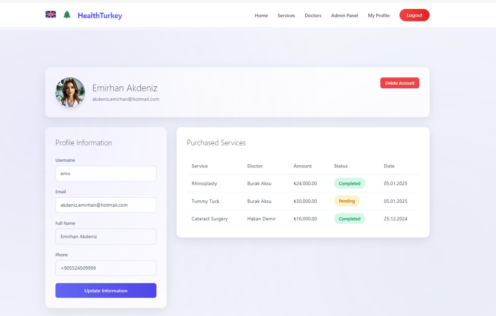

# 🏥 Modern Health Tourism Web Site

A modern and comprehensive web platform connecting international patients with Turkish healthcare providers.

## Overview
This comprehensive Health Tourism Platform is a web-based application designed to connect international patients with Turkish healthcare providers. The system streamlines the process of medical tourism, making it easier for patients to find, compare, and book medical treatments in Turkey.

## Project Contributors
This project was developed collaboratively by:

- Emirhan Akdeniz [@emirhan35s](https://github.com/emirhan35s)
- Ulaş Demir [@Ulashh1](https://github.com/Ulashh1)

## Application Screenshots
<details>
<summary>Click to view screenshots</summary>

### Homepage


### Services Page


### Profile


### Admin Dashboard


</details>

## Features

### For Patients
- User registration and login system
- Browse available medical services
- View detailed doctor profiles
- Service booking and management
- Profile management
- Secure payment processing
- Email notifications
- Password recovery functionality

### For Doctors
- Professional profile management
- Service management
- Patient appointment tracking
- Profile customization options

### For Administrators
- User management dashboard
- Service management
- Doctor verification system
- Content management
- User activity monitoring

## Technical Details

### Built With
- PHP 7.4+
- MySQL Database
- HTML5, CSS3, JavaScript
- Bootstrap Framework
- PHPMailer for email functionality
- PHPSpreadsheet for document handling
- jQuery for interactive features

### Key Components
- User authentication system
- Profile management system
- Service booking system
- Email notification system
- Image upload and management
- Secure password handling
- Multi-language support
- Responsive design

## Installation

### Prerequisites
- PHP 7.4 or higher
- MySQL 5.7 or higher
- Apache/Nginx web server
- Composer for dependency management
- SSL certificate for secure connections

### Setup Instructions
1. Clone the repository:
```bash
git clone https://github.com/emirhan35s/Modern-Health-Tourism-Web-Site.git
```

2. Install dependencies:
```bash
cd health_tourism
composer install
```

3. Configure database:
- Create a new MySQL database
- Import the provided SQL schema
- Update database credentials in config file

4. Configure email settings:
- Update SMTP settings in the configuration
- Test email functionality

5. Set up web server:
- Configure Apache/Nginx to serve the application
- Ensure proper permissions are set
- Enable required PHP extensions

## Security Features
- Secure password hashing
- SQL injection prevention
- XSS protection
- CSRF protection
- Secure session management
- Input validation and sanitization
- Secure file upload handling

## Contributing
We welcome contributions to improve the Health Tourism Platform. Please follow these steps:

1. Fork the repository
2. Create your feature branch (`git checkout -b feature/YourFeature`)
3. Commit your changes (`git commit -m 'Add some feature'`)
4. Push to the branch (`git push origin feature/YourFeature`)
5. Open a Pull Request

## License
This project is licensed under the MIT License - see the [LICENSE](LICENSE) file for details.

## Contact
For any queries regarding this project, please open an issue in the repository or contact:
- Email: akdeniz.emirhan@hotmail.com
- GitHub: @emirhan35s
- Project Repository: https://github.com/emirhan35s/Modern-Health-Tourism-Web-Site

## Acknowledgments
- Special thanks to all contributors and supporters
- Turkish Healthcare Tourism Association
- Medical facilities in Turkey for their cooperation
- Open source community for various tools and libraries used 
